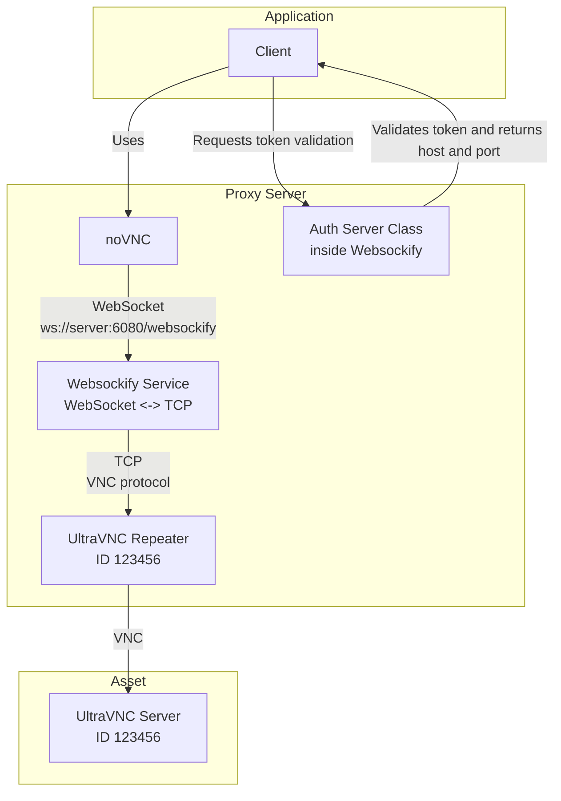
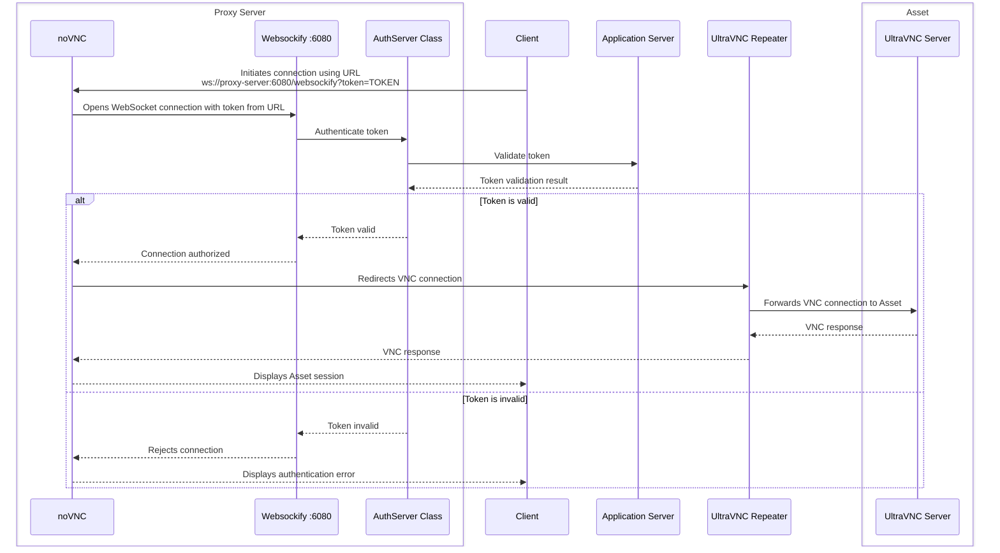

# noVNC project for websockify development
========================================

This project implements websockify under python 3, it is an adaptation from the previous version from AD project digitization v1.1

## Planning for project adaptation

1. Modify Auth class for token plugin, use python 3 library `requests`
2. Modify the function `closed` to use `requests` library
3. Build a test server with `flask` to test the modified version of websockify, this server will implement the logic of validation and creation of session id and token that noVNC and websockify will use to connect to the remote ultravnc server using the repeater.

## Development server

The development server implemented using flask is for testing the needed features for the websockify server, it is not intended to be used as production server, it to emulate the process of validation and creation of session id and token that noVNC and websockify will use to connect to the remote ultravnc server using the repeater.

### The source app start the first step to try to connect to remote ultravnc server

The first step is triggered by the source app, in the version v1.1 this source app is the 3xs AD app, the trigger is located in a button that execute the process of create a session id and token, then perform a request to the url on the proxy or the built-in 3xs server, this requets is to noVNC hmtl client entry point, the url is like this:

```
http://<proxy_or_3xs_server>/remote.html?adp=<token>
```

```
http://10.11.54.40:6080/remote.html?&adp=9ad2904a-482a-43ed-8787-18f136be3323&repeaterID=1006&autoconnect=true&resize=scale&shared=true&reconnect=true&reconnect_delay=5000
```

The noVNC client redirect the request to the websockify server with the token, then the websockify server validate the token performing a request to the source app, in this case the 3xs AD app, in the url:

```
http://<ad_app>:80/ahm/cms_validation.json?adp=<token>
```

The adp app validate the token and return:

```json
{
    "validation": true,
    "id": some data,
}
```

The filed validation is true if the token is valid

If the validation is different of true, the websockify server call a functiion `closed` by sendign an id parameter (thus semas to be a random id) and a status filed with string in 0

```python
# Envia el evento de cierre de la conexion al servidor del Asset Digitization
def closed(self, id, status):
    connection = httplib.HTTPConnection(adpapp[0], adpapp[1])
    connection.request("GET", url+"?id="+str(id)+"&status="+str(status))
    response = connection.getresponse()
    connection.close()
```

When the validation is true the websockify server return the repeater ip and port to upgrade the connection to websocket and start the communication with the remote ultravnc server using the repeater.

## Executing the sebsockify server

Te version v1.1 run the proxy with the command:

```bash
#!/bin/bash
nohup /usr/local/adpgcc/Version1.1/websockify-master/run \
--web="/usr/local/adpgcc/Version1.1/noVNC-master" \
--token-plugin=AuthServer 6080 >> /var/log/adremote.log &
```

> [!TIP] No hang up, run the programmin background even if terminal windows is closed.

In the line `--token-plugin=AuthServer 6080 >> /var/log/adremote.log &`, AuthServer is the name of the class within the module `token_plugins.py`, by this the logic previously described is implemented, the port 6080 is the port where the websockify server will listen for incoming connections.

Whithin the file `run`:

```bash
#!/usr/bin/env sh
set -e
cd "$(dirname "$0")"
exec python -m websockify "$@"
```

Explanation:
- `#!/usr/bin/env sh`: Especifica que el script debe ejecutarse con el intérprete de comandos `sh`.
- `set -e`: Hace que el script se detenga si cualquier comando devuelve un error.
- `cd "$(dirname "$0")"`: Cambia el directorio de trabajo al directorio donde se encuentra el script, asegurando que los comandos posteriores se ejecuten en el contexto correcto.
- `exec python -m websockify "$@"`: Ejecuta el módulo `websockify` con cualquier argumento que se le haya pasado al script, reemplazando el proceso actual del script con el proceso de Python. Esto es útil para asegurar que el script se ejecute correctamente y que cualquier argumento se pase al módulo `websockify` sin necesidad de manejar manualmente los argumentos dentro del script.

# Installation of RCMS in Ubuntu Server

## Summary

1. Download the UltraVNC Repeater source code
2. Install the Linux compiler and build dependencies
3. Compile and install the UltraVNC Repeater
4. Create the `uvncrep` system user for the service
5. Test the repeater manually
6. Create and configure the `uvncrepeater.service` systemd service
7. Configure persistent systemd journal logs
8. Check the status of the `uvncrepeater` service
9. Check the service logs with `journalctl` and the repeater log file
10. Keep the old `init.d` script as a reference and confirm the systemd service file
11. Edit `/etc/uvnc/uvncrepeater.ini` with the RCMS configuration

---

##  Basic componentes

1. noVNC
2. Websockify
3. UltraVNC Repeater
4. UltraVNC Server

---

###### 1. Download the ultravnc server

Create a directory to store the UltraVNC Repeater source code:
```bash
mkdir -p ~/uvnc_repeater
cd ~/uvnc_repeater
```

If internet access, try in CLI using the following command to download the UltraVNC Repeater source code:
```bash
wget http://www.uvnc.eu/download/repeater/uvncrepeater.tar.gz
```

If not, you will need to download the UltraVNC Repeater source code on a machine with internet access and then transfer it to the server using ssh session:
```bash
scp /path/to/uvncrepeater.tar.gz user@server:~/uvnc_repeater
```

###### 2. Install UVNC Repeter

```bash
tar -xzf uvncrepeater.tar.gz # Unzip the downloaded file
cd UVNCRepeater # Go to the unzipped folder
make # Compile the UltraVNC Repeater
sudo make install # Install the repeater, this will copy the files to /usr/local/bin and /usr/local/lib
```

If ubuntu is minimized version probably you will need to install the build-essential package:
```bash
sudo apt update
sudo apt install build-essential
```

expected output:
```bash
cp -R repeater /usr/sbin/uvncrepeatersvc
cp -R start-stop-daemon /usr/sbin/start-stop-daemon
cp -R uvncrepeater /etc/init.d/uvncrepeater
cp -R uvncrepeater.ini /etc/uvnc/uvncrepeater.ini
cat message

add user uvncrep with command: "adduser uvncrep -s /bin/false"
```

After installation you can check that the file is in `/usr/sbin/uvncrepeatersvc`
```bash
ls /usr/sbin | grep uvnc
```

###### 3. Add user for service

```bash
sudo useradd -r -s /usr/sbin/nologin uvncrep
```

`r` &rarr; Creates a system user (no /home directory, reserved UID < 1000)
`s` &rarr; Assigns a null shell (disables interactive console/SSH login)
uvncrep &rarr; User name

#### 4. [TEST] - Execute the service

Move to the directory:
```bash
cd /usr/sbin
```

 Execute the repeater manually:

execute:
```bash
./uvncrepeatersvc
```

if the repeater is running, you should see the following output:

```bash
UltraVnc Linux Repeater version 0.14
UltraVnc Fri Aug 28 21:28:31 2026 > main(): ini file (/etc/uvnc/uvncrepeater.ini) read error, using defaults
UltraVnc Fri Aug 28 21:28:31 2026 > listInitializationValues(): viewerPort : 5900
UltraVnc Fri Aug 28 21:28:31 2026 > listInitializationValues(): serverPort : 5500
UltraVnc Fri Aug 28 21:28:31 2026 > listInitializationValues(): maxSessions: 100
UltraVnc Fri Aug 28 21:28:31 2026 > listInitializationValues(): loggingLevel: 2
UltraVnc Fri Aug 28 21:28:31 2026 > listInitializationValues(): ownIpAddress (0.0.0.0 = listen all interfaces) : 0.0.0.0
UltraVnc Fri Aug 28 21:28:31 2026 > listInitializationValues(): runAsUser (if started as root) : uvncrep
UltraVnc Fri Aug 28 21:28:31 2026 > listInitializationValues(): Mode 1 connections allowed : Yes
UltraVnc Fri Aug 28 21:28:31 2026 > listInitializationValues(): Mode 2 connections allowed : Yes
UltraVnc Fri Aug 28 21:28:31 2026 > listInitializationValues(): Mode 1 allowed server port (0=All) : 0
UltraVnc Fri Aug 28 21:28:31 2026 > listInitializationValues(): Mode 1 requires listed addresses : No
UltraVnc Fri Aug 28 21:28:31 2026 > listInitializationValues(): Mode 2 requires listed ID numbers : No
UltraVnc Fri Aug 28 21:28:31 2026 > listInitializationValues(): useEventInterface: false
UltraVnc Fri Aug 28 21:28:31 2026 > listInitializationValues(): eventListenerHost : localhost
UltraVnc Fri Aug 28 21:28:31 2026 > listInitializationValues(): eventListenerPort : 2002
UltraVnc Fri Aug 28 21:28:31 2026 > listInitializationValues(): useHttpForEventListener : false
UltraVnc Fri Aug 28 21:28:31 2026 > routeConnections(): starting select() loop, terminate with ctrl+c
```

Terminate the repeater with ctrl+c

```bash
UltraVnc Fri Apr 17 08:36:19 2026 > listInitializationValues(): viewerPort : 5900
UltraVnc Fri Apr 17 08:36:19 2026 > listInitializationValues(): serverPort : 5901
UltraVnc Fri Apr 17 08:36:19 2026 > listInitializationValues(): maxSessions: 100
UltraVnc Fri Apr 17 08:36:19 2026 > listInitializationValues(): loggingLevel: 3
UltraVnc Fri Apr 17 08:36:19 2026 > listInitializationValues(): ownIpAddress (0.0.0.0 = listen all interfaces) : 0.0.0.0
UltraVnc Fri Apr 17 08:36:19 2026 > listInitializationValues(): runAsUser (if started as root) : uvncrep
UltraVnc Fri Apr 17 08:36:19 2026 > listInitializationValues(): Mode 1 connections allowed : No
UltraVnc Fri Apr 17 08:36:19 2026 > listInitializationValues(): Mode 2 connections allowed : Yes
UltraVnc Fri Apr 17 08:36:19 2026 > listInitializationValues(): Mode 1 allowed server port (0=All) : 0
UltraVnc Fri Apr 17 08:36:19 2026 > listInitializationValues(): Mode 1 requires listed addresses : No
UltraVnc Fri Apr 17 08:36:19 2026 > listInitializationValues(): Mode 2 requires listed ID numbers : Yes
UltraVnc Fri Apr 17 08:36:19 2026 > listInitializationValues(): Mode 2 allowed ID list (0=Not allowed): 1001 1002 1003 1004 1005 1006 1007 1008 1009 1010 1011 1012 1013 1014 2014 2015 2016 2017 2037 2038 2039 2040 2041 2042 2043 2044 2045 2046 2049 2050 2051 2052 2053 2054 2090 2091 2092 2093 2137 2138 2143 2144 2145 2146 2318 2319 2323 2324 2325 2326 2327 2328 2329 2330 2905 2906 2914 2918 2919 2921 2923 2925 0 0 0 0 0 0 0 0 0 0 0 0 0 0 0 0 0 0 0 0 0 0 0 0 0 0 0 0 0 0 0 0 0 0 0 0 0 0
UltraVnc Fri Apr 17 08:36:19 2026 > listInitializationValues(): useEventInterface: false
UltraVnc Fri Apr 17 08:36:19 2026 > listInitializationValues(): eventListenerHost : localhost
UltraVnc Fri Apr 17 08:36:19 2026 > listInitializationValues(): eventListenerPort : 2002
UltraVnc Fri Apr 17 08:36:19 2026 > listInitializationValues(): useHttpForEventListener : true
UltraVnc Fri Apr 17 08:36:19 2026 > startListeningOnPort(): socket() initialized
UltraVnc Fri Apr 17 08:36:19 2026 > startListeningOnPort(): setsockopt() success
UltraVnc Fri Apr 17 08:36:19 2026 > startListeningOnPort(): bind() to (ip: 0.0.0.0, port: 5900) succeeded
UltraVnc Fri Apr 17 08:36:19 2026 > startListeningOnPort(): listen() succeeded
UltraVnc Fri Apr 17 08:36:19 2026 > startListeningOnPort(): socket() initialized
UltraVnc Fri Apr 17 08:36:19 2026 > startListeningOnPort(): setsockopt() success
UltraVnc Fri Apr 17 08:36:19 2026 > startListeningOnPort(): bind() to (ip: 0.0.0.0, port: 5901) succeeded
UltraVnc Fri Apr 17 08:36:19 2026 > startListeningOnPort(): listen() succeeded
UltraVnc Fri Apr 17 08:36:19 2026 > routeConnections(): starting select() loop, terminate with ctrl+c
```

#### 5. Create the service for uvncrepeater

Create the service file:
```bash
sudo nano /etc/systemd/system/uvncrepeater.service
```

If not installed nano, you can install it using the following command:
```bash
sudo apt-get install nano
```
##### Error with the old init.d script

The script of init.d is a classic script used before systemd, this is pre-systemd (SysVinit or compatible)
To avoid error with the old init.d script, you should check if it exists and remove it before starting the service with systemd.
```bash
ls /etc/init.d/uvncrepeater
```
Remove the old script to avoid errors when starting the service with systemd.
```bash
sudo rm /etc/init.d/uvncrepeater
```

Content for the service file (Translation from init.d to systemd):

```ini
[Unit]
Description=UltraVNC Repeater
After=network.target

[Service]
Type=simple
ExecStart=/usr/sbin/uvncrepeatersvc /etc/uvnc/uvncrepeater.ini
Restart=on-failure
RestartSec=3

# User for running the service, this is the same user created for the init.d script
User=uvncrep
Group=uvncrep

# Logs (systemd handles this, but if you want a file as well:)
StandardOutput=append:/var/log/uvncrepeater.log
StandardError=append:/var/log/uvncrepeater.log

[Install]
WantedBy=multi-user.target
```

Notes:
Every time after changes in service config restart the service:

```bash
sudo systemctl daemon-reload
sudo systemctl enable uvncrepeater
sudo systemctl restart uvncrepeater
```

#### 6. Journal logs configuration for increasing the management and performance of the logs

Enter in the configuration file for the systemd journal:
```bash
sudo nano /etc/systemd/journald.conf
```

Uncomment the following lines to configure the journal logs:
```ini
[Journal]
Storage=persistent
SystemMaxUse=200M
SystemKeepFree=100M
MaxRetentionSec=7day
Compress=yes
RateLimitIntervalSec=30s
RateLimitBurst=1000
```

Give ctrl+o to save the file and ctrl+x to exit the editor.

Restart the journal
```bash
sudo systemctl restart systemd-journald
```


Restart the systemd daemon to recognize the new service:
```bash
sudo systemctl daemon-reload
```

sudo systemctl enable uvncrepeater
sudo systemctl start uvncrepeater

#### 7. Check the status of the service
```bash
sudo systemctl status uvncrepeater
```

The exepected output should show that the uvncrepeater service is active and running, ignore the srvubu115 hostname, this was a development server.

```bash
● uvncrepeater.service - UltraVNC Repeater
     Loaded: loaded (/etc/systemd/system/uvncrepeater.service; enabled; preset: enabled)
     Active: active (running) since Fri 2026-08-28 21:50:23 UTC; 1min 11s ago
   Main PID: 2620 (uvncrepeatersvc)
      Tasks: 1 (limit: 18792)
     Memory: 304.0K (peak: 424.0K)
        CPU: 6ms
     CGroup: /system.slice/uvncrepeater.service
             └─2620 /usr/sbin/uvncrepeatersvc /etc/uvnc/uvncrepeater.ini

Aug 28 21:50:23 srvubu115 systemd[1]: Started uvncrepeater.service - UltraVNC Repeater.
```

#### 8. Logs with journalctl

To view the logs of the uvncrepeater service, you can use the `journalctl` command:

check logs fo the service:

```bash
journalctl -u uvncrepeater -f
```
Give permissions to the ini file, and log file to the user uvncrep:

Take account, when you need to make troubleshooting, you nwil need to give a look in the log file:
```bash
cat /var/log/uvncrepeater.log
```
```bash
sudo chown uvncrep:uvncrep /etc/uvnc/uvncrepeater.ini
sudo chown uvncrep:uvncrep /var/log/uvncrepeater.log
```
## 10. Old script of uvncrepeater service
script de init.d (for reference)
```bash
#!/bin/sh
#!/bin/sh

PATH=/sbin:/bin
UVNCREPPID=/var/run/uvncrepeater.pid
UVNCREPLOG=/var/log/uvncrepeater.log
UVNCREPRUN=/usr/sbin/uvncrepeater-log
UVNCREPSVC=/usr/sbin/uvncrepeatersvc
UVNCREPINI=/etc/uvnc/uvncrepeater.ini

#if service file does not exist then exit the script

if test ! -x $UVNCREPSVC ; then
  echo $UVNCREPSVC file was not found.
  echo Exiting...
  exit 2
fi

#Create the file to start the service if it does not exist

if test ! -x $UVNCREPRUN ; then
  echo '#!/bin/sh' > $UVNCREPRUN
#    echo 'exec' $UVNCREPSVC '2>>' $UVNCREPLOG  >> $UVNCREPRUN
  echo 'exec' $UVNCREPSVC $UVNCREPINI '2>>' $UVNCREPLOG  >> $UVNCREPRUN
  chmod +x $UVNCREPRUN
fi

case "$1" in
start)
  echo -n "Running UltraVNC Repeater..."
  /usr/sbin/start-stop-daemon --start -b -m -p $UVNCREPPID --exec $UVNCREPRUN -- $UVNCREPLOG
  echo "."
  ;;
stop)
  echo  "Stopping UltraVNC Repeater..."
  /usr/sbin/start-stop-daemon --stop -p $UVNCREPPID
  rm $UVNCREPPID
  ;;
*)
  echo "Usage: $0 {start|stop}"
  exit 1
esac
exit 0
```

Confirm that the service exists in:

```bash
ls /etc/systemd/system/uvncrepeater.service
```


#### 11. Edit the uvncrepeater.ini file

Move to the directory:
```bash
cd /etc/uvnc
```

Rename file from the original:
```bash
sudo mv uvncrepeater.ini uvncrepeater_old.ini
```

Modify the file with the content configured for RCMS, save file.
```bash
sudo nano uvncrepeater.ini
```

Restart the uvncrepeater service to apply the changes:
```bash
sudo systemctl restart uvncrepeater
```

## Linux Utilities

List services:
```bash
systemctl list-units --type=service 
```

Look for only a specific service:
```bash
systemctl list-units --type=service | grep uvncrepeater
```

List open ports:
```bash
ss -tulnp
```

## Configs from Ad tech team

Configuration for the service, only as reference

```ini
[Unit]
Description=websockify.proxy
After=syslog.target network.target

[Service]
Type=simple
ExecStart=/usr/local/bin/websockify 6080 localhost:5900

PIDFile=/home/student/.vnc/%H%i.pid
ExecStop=/bin/sh -c '/usr/bin/killall websockify'
KillMode=process
Restart=on-failure
User=root
Group=root

[Install]
WantedBy=multi-user.target
```

## Testing the UVNC repeater with a VNC client configured with reverse connection


# VNC server for Asset Digitization application




# Sequence diagram for VNC connection through the proxy server
